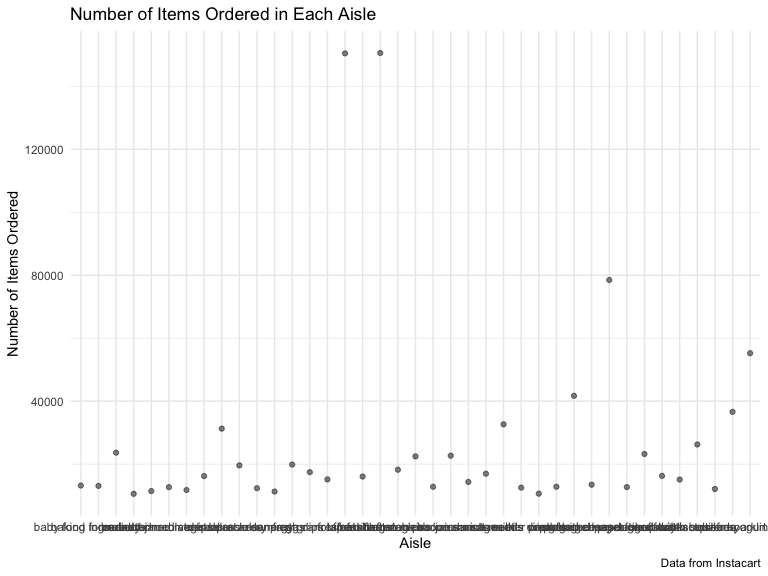

p8105\_hw3\_mm5351
================
Martha Mulugeta
10/6/2019

***Problem 1***

``` r
library(p8105.datasets)
data("instacart")
```

The instacart dataset contains 1384617 rows indicating the number of
observations and 15 columns indicating the number of variables. Key
variables include the numerical values for the order identifier
(order\_id), product ifentifier (product\_id) and the customer
identifier (user\_id). There are also identifiers specific to the types
of products ordered such as the product name (product\_name), the aisle
it is from (aisle) and the department (department).

For example, for the customer with the ID 112108, the products ordered
include Bulgarian Yogurt, Organic 4% Milk Fat Whole Milk Cottage Cheese,
Organic Celery Hearts, Cucumber Kirby, Lightly Smoked Sardines in Olive
Oil, Bag of Organic Bananas, Organic Hass Avocado, Organic Whole String
Cheese. These products came from the following aisles respectively:
yogurt, other creams cheeses, fresh vegetables, fresh vegetables, canned
meat seafood, fresh fruits, fresh fruits, packaged cheese.

``` r
aisle_data = 
  instacart %>% 
  select(aisle) %>% 
  count(aisle) %>% 
  arrange(desc(n)) 
```

There are 134 aisles. The top five aisles that food is ordered from in
descending order include fresh vegetables, fresh fruits, packaged
vegetables, fruits, yogurt, and packaged cheese.

``` r
aisle_plot =
  aisle_data %>% 
  arrange(aisle) %>% 
  filter(n > 10000)
  
##create plot  
aisle_plot %>% 
  ggplot(aes(x = n, y = aisle)) +
  geom_point(alpha = 0.5) +
    labs(
    title = "Number of Grocery Items Ordered in Each Aisle",
    x = "Number of Items Ordered",
    y = "Aisle",
    caption = "Data from Instacart")
```



``` r
aisle_table1 =
  instacart %>% 
  select(aisle, product_name) %>% 
  filter(aisle %in% c("baking ingredients", "dog food care", "packaged vegetables fruits")) %>% 
  group_by(aisle) %>% 
  count(product_name) %>%
 mutate(product_rank = min_rank(desc(n))) %>% 
  filter(product_rank < 4) %>% 
  arrange(desc(n)) %>% 
  select(everything(), -product_rank)
```

``` r
aisle_table2 = 
  instacart %>% 
  select(product_name, order_dow, order_hour_of_day) %>% 
  filter(product_name %in% c("Pink Lady Apples", "Coffee Ice Cream")) %>% 
  group_by(product_name, order_dow) %>% 
  summarise(
    mean_hour = mean(order_hour_of_day)
  ) %>%  
  arrange(order_dow) %>%
  ##Format table  
  pivot_wider(
    names_from = order_dow,
    values_from = mean_hour,
  ) 
```

***Problem 2***

``` r
library(p8105.datasets)
data("brfss_smart2010") 
```

``` r
brfss_smart2010 =
brfss_smart2010 %>% 
  janitor::clean_names() %>% 
  filter(topic == "Overall Health") %>% 
  mutate(
    response = factor(response, levels = c("Poor", "Fair", "Good", "Very good", "Excellent"), ordered = TRUE)) 
```

\#\#mutate( \#\#State = Locationabbr, \#\#County = Locationdesc \#\#)
\#\#Not allowing me to change the column names

In 2002, which states were observed at 7 or more locations? What about
in 2010?

``` r
brfss_smart2010 %>% 
  select(year, locationabbr, locationdesc) %>% 
  filter(year == 2002)
```

    ## # A tibble: 785 x 3
    ##     year locationabbr locationdesc               
    ##    <int> <chr>        <chr>                      
    ##  1  2002 AL           AL - Jefferson County      
    ##  2  2002 AL           AL - Jefferson County      
    ##  3  2002 AL           AL - Jefferson County      
    ##  4  2002 AL           AL - Jefferson County      
    ##  5  2002 AL           AL - Jefferson County      
    ##  6  2002 AK           AK - Anchorage Municipality
    ##  7  2002 AK           AK - Anchorage Municipality
    ##  8  2002 AK           AK - Anchorage Municipality
    ##  9  2002 AK           AK - Anchorage Municipality
    ## 10  2002 AK           AK - Anchorage Municipality
    ## # … with 775 more rows

``` r
##NOT DONE!!!
```

Construct a dataset that is limited to Excellent responses, and
contains, year, state, and a variable that averages the data\_value
across locations within a state. Make a “spaghetti” plot of this average
value over time within a state (that is, make a plot showing a line for
each state across years – the geom\_line geometry and group aesthetic
will help).

``` r
excellent_data = 
brfss_smart2010 %>% 
  filter(response == "Excellent") %>% 
  group_by(locationabbr) %>% 
  mutate(
    mean_data = mean(data_value)
  ) %>% 
  select(response, year, locationabbr, mean_data)    
```

``` r
##spaghetti plot
excellent_plot =
  excellent_data %>% 
  ggplot(aes(x = year, y = mean_data)) +
  geom_line()
```

Need to finish question 2

***Problem 3***

``` r
accel_data = 
  read_csv("./Data/accel_data.csv") %>% 
  janitor::clean_names() %>% 
  mutate(
    weekday = day %in% c("Monday", "Tuesday", "Wednesday", "Thursday", "Friday"),
    weekend = day %in% c("Saturday", "Sunday"))
```

    ## Parsed with column specification:
    ## cols(
    ##   .default = col_double(),
    ##   day = col_character()
    ## )

    ## See spec(...) for full column specifications.
