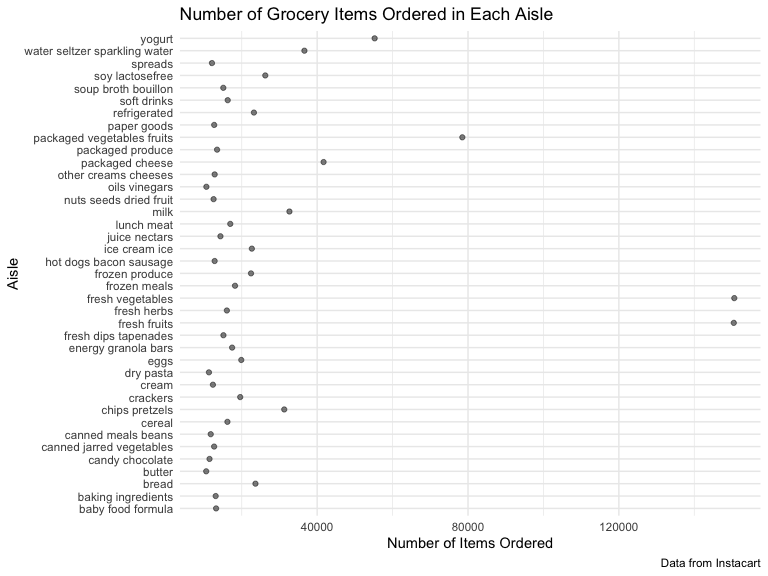
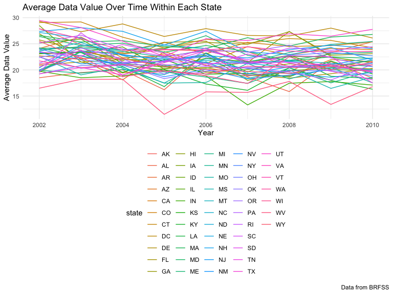
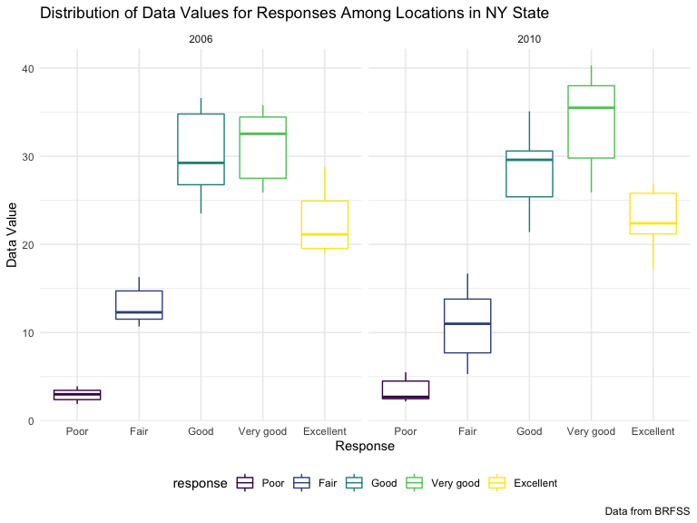
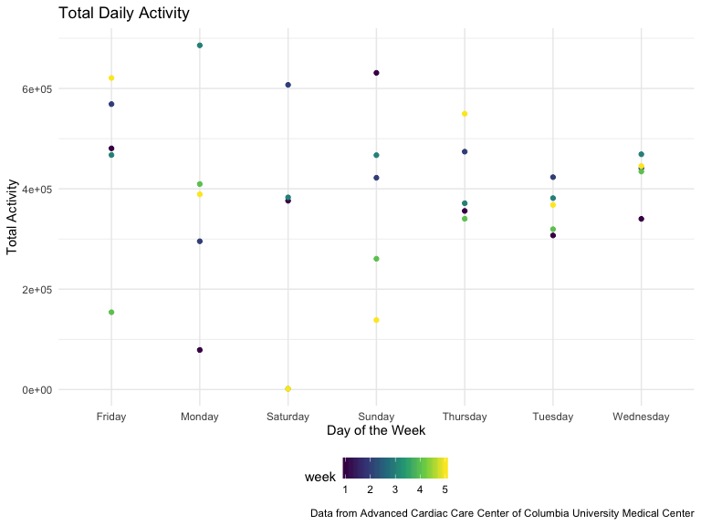
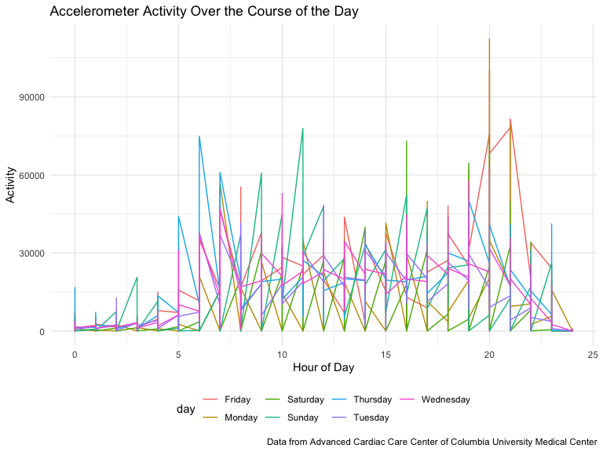

p8105\_hw3\_mm5351
================
Martha Mulugeta
10/6/2019

***Problem 1***

``` r
library(p8105.datasets)
data("instacart")
```

The instacart dataset contains 1384617 rows indicating the number of
observations and 15 columns indicating the number of variables. Key
variables include the numerical values for the order identifier
(order\_id), product ifentifier (product\_id) and the customer
identifier (user\_id). There are also identifiers specific to the types
of products ordered such as the product name (product\_name), the aisle
it is from (aisle) and the department (department).

For example, for the customer with the ID 112108, the products ordered
include Bulgarian Yogurt, Organic 4% Milk Fat Whole Milk Cottage Cheese,
Organic Celery Hearts, Cucumber Kirby, Lightly Smoked Sardines in Olive
Oil, Bag of Organic Bananas, Organic Hass Avocado, Organic Whole String
Cheese. These products came from the following aisles respectively:
yogurt, other creams cheeses, fresh vegetables, fresh vegetables, canned
meat seafood, fresh fruits, fresh fruits, packaged cheese. These
products also came from the following departments respectively: dairy
eggs, dairy eggs, produce, produce, canned goods, produce, produce,
dairy eggs.

``` r
aisle_data = 
  instacart %>% 
  select(aisle) %>% 
  count(aisle) %>% 
  arrange(desc(n)) 
```

There are 134 aisles. The top five aisles that food is ordered from in
descending order include fresh vegetables, fresh fruits, packaged
vegetables fruits, yogurt, packaged cheese.

``` r
aisle_plot =
  aisle_data %>% 
  arrange(aisle) %>% 
  filter(n > 10000)
  
##create plot  
aisle_plot %>% 
  ggplot(aes(x = n, y = aisle)) +
  geom_point(alpha = 0.5) +
    labs(
    title = "Number of Grocery Items Ordered in Each Aisle",
    x = "Number of Items Ordered",
    y = "Aisle",
    caption = "Data from Instacart")
```



``` r
aisle_popular =
  instacart %>% 
  select(aisle, product_name) %>% 
  filter(aisle %in% c("baking ingredients", "dog food care", "packaged vegetables fruits")) %>% 
  group_by(aisle) %>% 
  count(product_name) %>%
  mutate(product_rank = min_rank(desc(n))) %>% 
  filter(product_rank < 4) %>% 
  arrange(desc(n)) %>% 
  select(everything(), -product_rank)
```

``` r
aisle_meanhour = 
  instacart %>% 
  select(product_name, order_dow, order_hour_of_day) %>% 
  filter(product_name %in% c("Pink Lady Apples", "Coffee Ice Cream")) %>% 
  group_by(product_name, order_dow) %>% 
  summarise(
    mean_hour = mean(order_hour_of_day)
  ) %>%  
  arrange(order_dow) %>%

##format table  
pivot_wider(
  names_from = order_dow,
  values_from = mean_hour,
) 
```

***Problem 2***

``` r
library(p8105.datasets)
data("brfss_smart2010") 
```

``` r
brfss_smart2010 =
  brfss_smart2010 %>% 
  janitor::clean_names() %>% 
  separate(col = locationdesc, sep = " -", into = c("state", "county")) %>%
  select(everything(), -locationabbr) %>% 
  filter(topic == "Overall Health") %>% 
  mutate(
    response = factor(response, levels = c("Poor", "Fair", "Good", "Very good", "Excellent"), ordered = TRUE)) 
```

``` r
location2002_data = 
  brfss_smart2010 %>% 
  select(year, state, county) %>%
  filter(year == 2002) %>% 
  group_by(state) %>% 
  count(state) %>% 
  filter(n >= 7)
```

In 2002, the 36 states observed at seven or more locations include AZ,
CO, CT, DE, FL, GA, HI, ID, IL, IN, KS, LA, MA, MD, ME, MI, MN, MO, NC,
NE, NH, NJ, NV, NY, OH, OK, OR, PA, RI, SC, SD, TN, TX, UT, VT, WA.

``` r
location2010_data = 
  brfss_smart2010 %>% 
  select(year, state, county) %>%
  filter(year == 2010) %>% 
  group_by(state) %>% 
  count(state) %>% 
  filter(n >= 7)
```

In 2010, the 45 states observed at seven or more locations include AL,
AR, AZ, CA, CO, CT, DE, FL, GA, HI, IA, ID, IL, IN, KS, LA, MA, MD, ME,
MI, MN, MO, MS, MT, NC, ND, NE, NH, NJ, NM, NV, NY, OH, OK, OR, PA, RI,
SC, SD, TN, TX, UT, VT, WA, WY.

``` r
excellent_data = 
  brfss_smart2010 %>% 
  filter(response == "Excellent") %>% 
  group_by(year, state) %>% 
  mutate(
    mean_data = mean(data_value)) %>% 
  select(response, year, state, mean_data) %>% 
  drop_na()

##spaghetti plot
excellent_data %>% 
  ggplot(aes(x = year, y = mean_data, group = state, color = state)) +
  geom_line() + 
     labs(
    title = "Average Data Value Over Time Within Each State",
    x = "Year",
    y = "Average Data Value",
    caption = "Data from BRFSS")
```



There is quite a bit of variation in the average data value between the
states, when limiting responses to “Excellent”. One of the locations
with the highest average data values consistently throughout the years
is DC, contrasting West Virginia which consistently ranked among the
lowest.

``` r
NY_data = 
  brfss_smart2010 %>% 
  select(year, state, county, response, data_value) %>% 
  mutate(state = as.factor(state)) %>% 
  filter(year %in% c(2006, 2010), state == "NY") 

##two-panel plot
NY_data %>% 
  ggplot(aes(x = response, y = data_value, color = response)) +
  geom_boxplot() +
  facet_grid(. ~year) +
     labs(
    title = "Distribution of Data Values for Responses Among Locations in NY State",
    x = "Response",
    y = "Data Value",
    caption = "Data from BRFSS")
```



In 2006, the responses with the highest data values were “Good” and
“Very good”, followed by “Excellent”, then “Fair”, and lastly “Poor”
with the lowest data values. Between “Good” and “Very good”, “Very good”
had a higher median data value, whereas “Good” had a larger
distribution. “Poor” responses had the smallest distribution.

In 2010, the overall trend was fairly similar. However, “Very good”
responses had both a larger median and distribution than in 2006 and in
comparison to “Good” responses. The distributions for “Poor” and “Fair”
responses increased. For “Excellent” responses, the interquartile range
spanned to include lower data values than in 2006.

***Problem 3***

``` r
accel_data = 
  read_csv("./Data/accel_data.csv") %>% 
  janitor::clean_names() %>% 
  mutate(
    weekday = day %in% c("Monday", "Tuesday", "Wednesday", "Thursday", "Friday")) %>% 
  pivot_longer(
    activity_1:activity_1440,
    names_to = "minute",
    names_prefix = "activity_",
    values_to = "activity"
    ) %>% 
  mutate(
    minute = as.numeric(minute),
    hour = minute %/% 60)
```

    ## Parsed with column specification:
    ## cols(
    ##   .default = col_double(),
    ##   day = col_character()
    ## )

    ## See spec(...) for full column specifications.

In the accel\_data dataset, there are 50400 rows indicating the activity
counts for every minute ofa 24-hour day over the course of 35 days. (60
minutes\* 24 hours \* 35 days = 50,400). There are 7 columns indicating
the number of variables. These key variables include the week number
(week), the day number out of 35 (day\_id), the day of the week (day),
whether or not it is a weekday (weekday), the minute of the day starting
at midnight (minute), the activity count (activity), and the hour of the
day (hour).

``` r
total_activity = 
accel_data %>% 
  group_by(week, day) %>% 
  summarize(
    total_activity = sum(activity)
  )

##identifying trends
total_activity %>% 
  ggplot((aes(x = day, y = total_activity, color = week))) +
  geom_point() +
     labs(
    title = "Total Daily Activity",
    x = "Day of the Week",
    y = "Total Activity",
    caption = "Data from Advanced Cardiac Care Center of Columbia University Medical Center")
```



Based on the above figure, we can see that there is more consistency in
total daily activity over the five weeks of observation on Tuesdays,
Wednesdays, and Thursdays. The other days of the week experienced a wide
range of activity counts over time. The lowest activity count was on a
Saturday, whereas the highest activity count was on a Monday.

``` r
accel_plot = 
accel_data %>%
  group_by(week, day, hour) %>% 
  summarize(
    total_activity = sum(activity)) 

##single-panel plot
accel_plot %>% 
ggplot((aes(x = hour, y = total_activity, color = day))) +
  geom_line() +
    labs(
  title = "Accelerometer Activity Over the Course of the Day",
  x = "Hour of Day",
  y = "Activity",
  caption = "Data from Advanced Cardiac Care Center of Columbia University Medical Center") 
```



Most of the activity for this individual occurs between hours 5 and 23,
with spikes in activity at hour 6, 11, 16, 20, and 21. It possible that
the individual goes to sleep between hours 23 and 5, and the minor
changes in activity between this range is attributable to movements in
sleep and/or getting up for various reasons (i.e. to get water or use
the restroom). Activity appears to be higher in the middle of the day
during the weekends and in the early morning and late evening during
weekdays. This could potentially be attributable to work during the week
in which the individual is more sedentary than on weekends.
